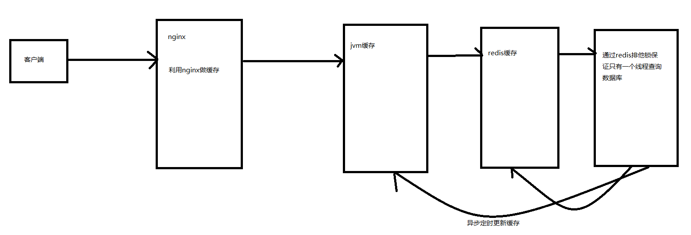

# test-three-cache
Java借助jvm缓存和redis实现多级缓存

jvm缓存利用了线程安全的ConCurrentHashMap来实现，目前暂未实现Caffeine进行分区，后续再添加。

异步更新redis缓存直接通过业务方法触发，jvm缓存更新打算引入zookeeper，通过zookeeper做分布式协调，jvm订阅zookeeper通过触发zookeeper迭代数据版本后进行数据拉取，从而进行缓存数据刷新。